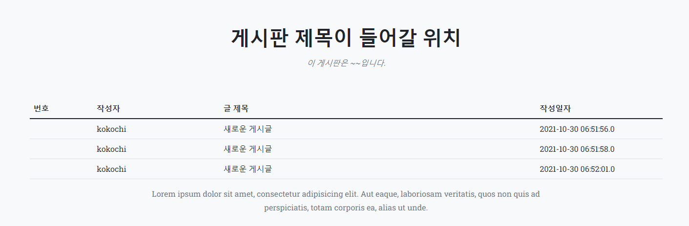

2021년 10월 29일자 프로젝트 진행
===================
## mysql - jpa 적용
프로젝트에 Mysql과 JPA를 등록하여 연동하는 작업을 진행함.
예제 게시판, 게시글 테이블을 생성하여 @Entity로 등록하여 테이블을 생성하였고,
해당 테이블에 값을 넣음.

JPA를 이용하여 Thymeleaf - Controller - Repository 간 데이터를 주고받아 표시

컨트롤러에서 게시판 데이터를 가져와서 리스트 상에 표시하는데에 성공.

## 내일의 목표
* 연동한 데이터베이스를 이용하여 게시판 CRUD를 구성
* 게시판 add, edit, view, list 페이지의 전체적인 디자인을 리뉴얼
* Thymeleaf 페이지를 모듈화 (head, navbar, content, footer 를 분리할 예정)