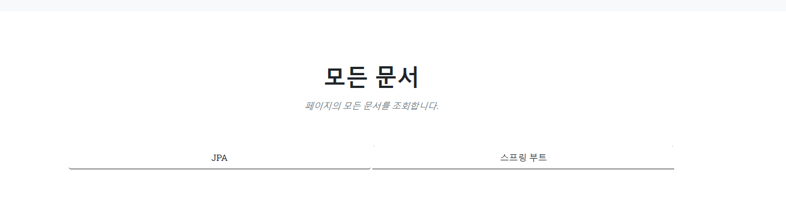
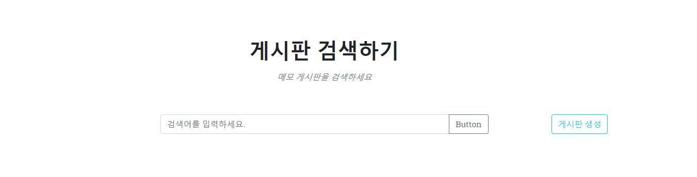
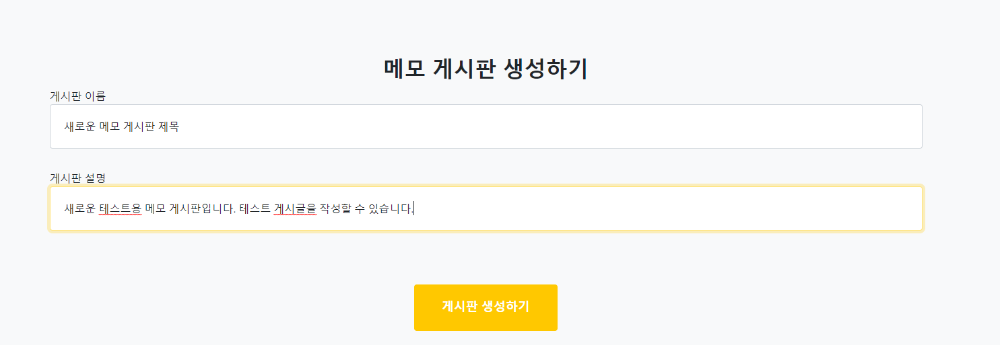
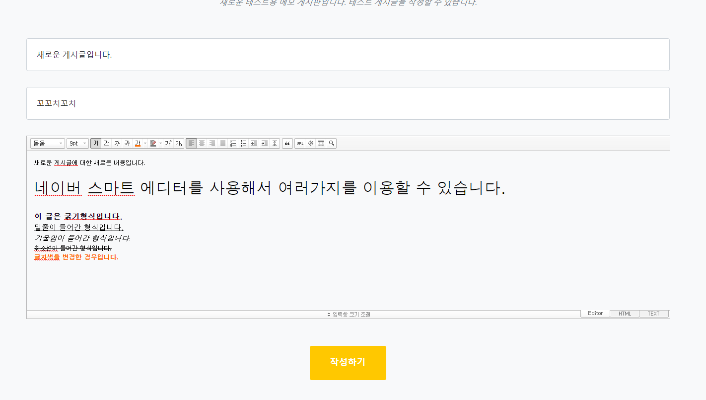
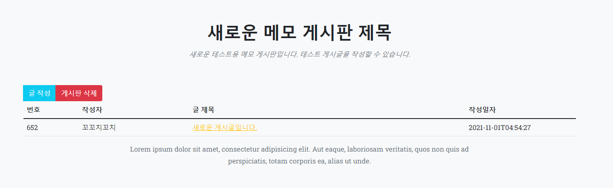
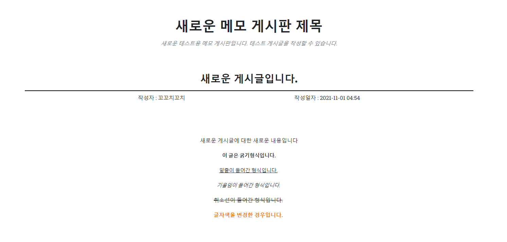

2021년 10월 31일자 프로젝트 진행
===================
### 1. 페이지의 모든 게시판을 조회 부분 구현
메모 페이지 홈에 모든 문서를 조회할 수 있는 부분을 추가하였습니다.

```
public List<MemoBoardMasterVO> getMemoBoardMasterListOrderByABC() {
    return memoBoardMasterRepository.findAll(Sort.by(Sort.Direction.ASC, "name"));
}
```
조회 쿼리는 JPA를 활용하여 위와같이 이름순으로 조회되도록 설정하였습니다.         
```
@Entity
@Table(name = "memo_board_master")
@Getter @Setter
@DynamicInsert @DynamicUpdate
public class MemoBoardMasterVO {
    @Id
    @GeneratedValue(
            strategy = GenerationType.SEQUENCE,
            generator = "Memo_board_GEN"
    )
    @Column(name = "ID")
    private Long id;                        // PK 값

    @Column(name = "NAME", nullable = false, columnDefinition = "VARCHAR(30) DEFAULT ''")
    private String name;                    // 게시판 이름

    @Column(name = "DESCRIPTION", nullable = false, columnDefinition = "VARCHAR(50) DEFAULT ''")
    private String description;             // 게시판 설명

    @Column(name = "CREATED_DATE", columnDefinition="TIMESTAMP DEFAULT CURRENT_TIMESTAMP", insertable=false, nullable = false)
    @CreationTimestamp
    private LocalDateTime createdDate;               //  생성 날짜

    @OneToMany(mappedBy = "master")
    private List<MemoBoardVO> boardList = new ArrayList<>();
}
```         
게시판VO의 형태는 위와 같습니다.         
          

### 2. 게시판 관련 CRUD를 구현
      
게시판 검색하기 오른쪽에 새로운 게시판을 생성하는 버튼을 만들었습니다.    

      
버튼 클릭시 게시판 생성 폼으로 이동하며, 폼에서는 게시판의 제목과 게시판의 설명을 작성할 수 있습니다.    

     
게시판을 생성하면 위와 같이 생성된 게시판의 리스트 폼으로 이동합니다.
```
public void addMemoBoardMaster(MemoBoardMasterVO memoBoardMasterVO) {
    memoBoardMasterRepository.save(memoBoardMasterVO);
}
```
게시판 추가 코드는 JPA의 save 메소드를 이용하여 저장하였습니다.     


### 3. 게시글 관련 CRUD를 구현
      
게시글 글 작성 클릭 시, 게시글을 생성할 수 있는 폼으로 이동합니다.     
게시글의 내용을 작성하는 부분은 네이버 스마트 에디터를 사용하였습니다.   

     
작성하기 버튼을 클릭하면, 해당 게시판의 리스트로 이동하며, 리스트에는 새로운 게시글이 생성되어있습니다.     

    
게시글로 들어가면, 게시글 상세보기 페이지로 이동하며, 스마트 에디터로 편집한 내용이 정상적으로 반영된 채로 출력됩니다.     
```         
@Entity
@Table(name = "memo_board")
@Getter @Setter
@DynamicInsert @DynamicUpdate
public class MemoBoardVO {
    @Id
    @GeneratedValue(
            strategy = GenerationType.SEQUENCE,
            generator = "Memo_board_GEN"
    )
    private Long id;                        // PK 값

    @ManyToOne(fetch = FetchType.LAZY)
    @JoinColumn(name = "master_id")
    private MemoBoardMasterVO master;       // 게시판 매핑

    @Column(nullable = false)
    private String title;                   // 게시글 제목

    @Column(nullable = false)
    private String writer;                  // 게시글 작성자

    private String contents;                // 게시글 내용

    @Column(columnDefinition = "tinyint(1) default 1")
    private Boolean isUse;                  // 사용가능 여부

    @Column(columnDefinition = "int default 0")
    private int readNum;                    // 조회수

    @Column(name = "CREATED_DATE", columnDefinition="TIMESTAMP DEFAULT CURRENT_TIMESTAMP", insertable=false, nullable = false)
    @CreationTimestamp
    private LocalDateTime createdDate;               //  생성 날짜
}
```         
게시글VO의 코드는 위와 같습니다.        
       
      
     

            
             
             
### 4. Thymeleaf 레이아웃 설정
memo 페이지의 전체적인 레이아웃 설정을 하였습니다.        
```
<html lang="ko" xmlns:th="http://www.thymeleaf.org">
<!-- headMain -->
<head th:fragment="headMain" ...>
<!-- //headMain -->

<!-- navbarMain -->
<nav th:fragment="navbarMain" ...>
<!-- //navbarMain -->

<!-- headerMain -->
<header th:fragment="headerMain" ...>
<!-- //headerMain -->

<!-- footerMain -->
<footer th:fragment="footerMain" ...>
<!-- //footerMain -->

<script th:fragment="memo-global-script">
    document.addEventListener("DOMContentLoaded", function(){
        // [::] ===== 전체 공통 스크립트 ===== [::]
        // [::] 경로 이동 스크립트
        document.querySelectorAll('.location-href').forEach((elem, idx) => {
            elem.addEventListener('click', (e) => {
                if(elem.classList.contains('confirm-btn') && !confirm(elem.getAttribute('data-confirm'))) return;
                location.href = elem.getAttribute('data-locationHref');
            })
        })

        document.querySelectorAll('.form-submit').forEach((elem, idx) => {
            elem.addEventListener('click', (e) => {
                if(elem.classList.contains('confirm-btn') && !confirm(elem.getAttribute('data-confirm'))) return;
                let parentForm = elem.closest('.action-form');
                console.log(parentForm);
                parentForm.action = elem.getAttribute('data-action')
                parentForm.method = elem.getAttribute('data-method')
                parentForm.submit();
            })
        })
        // [::] ===== //전체 공통 스크립트 ===== [::]
    });
</script>
```            
레이아웃은 th:fragment을 이용하여, memoLayout.html 파일 하나에 모든 레이아웃 관련된 설정을 모아놓은 형태입니다.         
여기서 memo-global-script 부분의 공통 스크립트 부분을 추가하여, 전체적으로 공통적으로 사용되는 스크립트를 모아두었습니다.       
공통 스크립트의 내용은 button에 location.href가 들어가는 경우를 위해서 class와 data-locationHref 값만 넣으면 a태그와 같이 사용될 수 있도록 지정하였습니다.         
이외에도 유동적으로 폼이 변경되어 사용되는 경우에도 클래스와 데이터값을 이용해서 바로 보내질 수 있도록 세팅해두었습니다.        
별도로 공통 스크립트가 필요한 경우 위의 공통 스크립트에 추가하여 적용할 예정입니다.        
        
       
       

```
<button type="button" class="btn btn-danger form-submit confirm-btn" data-confirm="게시판을 삭제하시겠습니까?" data-action="/memo/master/delete/process" data-method="post">게시판 삭제</button>
```       
게시판 삭제 버튼 예제 (form-submit 클래스를 추가하여, 이벤트를 활성화, data-action, data-method 값을 적용하여 해당 폼을 작동하도록 하였고, data-confirm을 통해서 컨펌을 받도록 구성하였다.)


### 다음의 목표
* 게시글 수정/삭제 기능
* 게시판 수정 기능
* 게시글에 이미지를 추가하여 작성할 수 있도록 할 예정
* 이미지와 관련해서, 서버에 이미지 저장, 첨부파일을 저장하는 구조를 구성
* 메모 홈페이지의 전체적인 디자인을 개선
* 최신 문서 리스트 가져오기 부분 만들기
* 게시글/게시판 검색기능