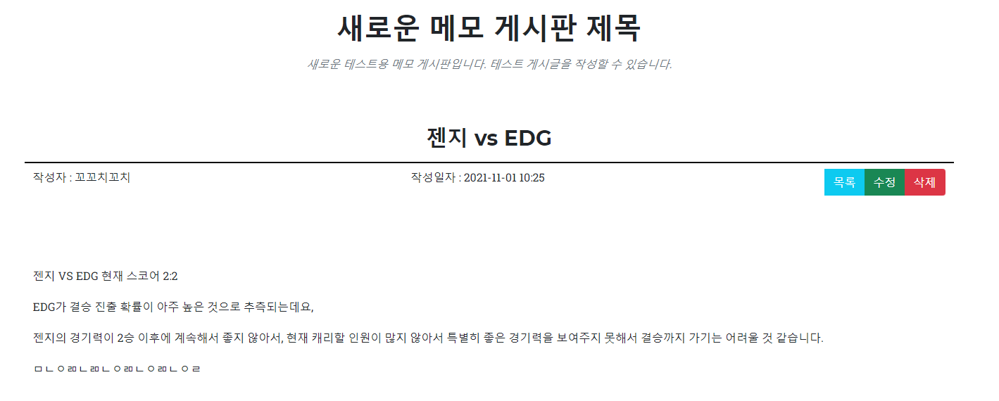
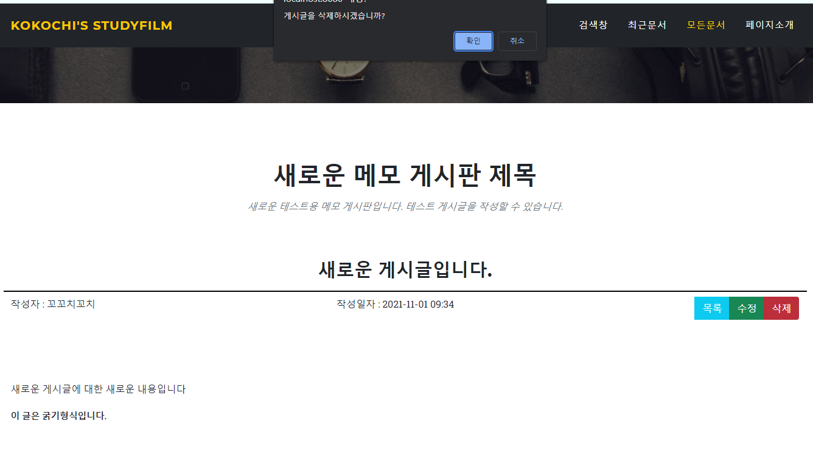
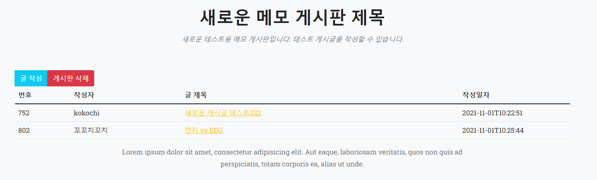

2021년 11월 1일자 프로젝트 진행
===================
### 1. 게시글 수정/삭제 기능 구현
    
게시글 상세보기 페이지에 목록 이동버튼, 수정버튼, 삭제버튼을 추가하였습니다.     
수정 버튼 클릭시에, 수정 폼으로 이동하여, 수정 처리가 가능해집니다.
````
@Transactional
@Modifying(clearAutomatically = true)
@Query(
        value = "UPDATE MemoBoardVO mb SET mb.title = :#{#memoBoardVO.title}, mb.writer = :#{#memoBoardVO.writer}, mb.contents = :#{#memoBoardVO.contents} WHERE mb.id = :#{#memoBoardVO.id}"
)
void updateBoard(MemoBoardVO memoBoardVO);
````
수정 처리의 경우에, update의 JPQL을 작성하여 동작하도록 하였습니다.   
쿼리를 간단하게 설명하면 다음과 같습니다.
1. update, delete 쿼리와 같이 테이블에 영향을 주는 쿼리문이기 떄문에 @Transactional을 추가하였습니다.
2. 수정문의 사용으로 @Modifying을 사용하였고, 여기서 벌크연산으로 인해서, 1차캐시를 무시하고 직접적으로 DB와 연결되어 1차 캐시의 값과 DB의 값이 달라지는 경우가 생기기 때문에, clearAutomatically를 true로 설정하였습니다.
3. 파라미터를 하나하나 값을 받아오기보다, 객체를 직접 매핑하여, :#{#객체} 형태로 매핑하는 방식을 사용하였습니다.

     
삭제버튼을 클릭하면 confirm문이 나오고, 확인 선택시에 삭제처리가 됩니다.      

      
삭제처리가 되면, 리스트로 이동하게 됩니다.