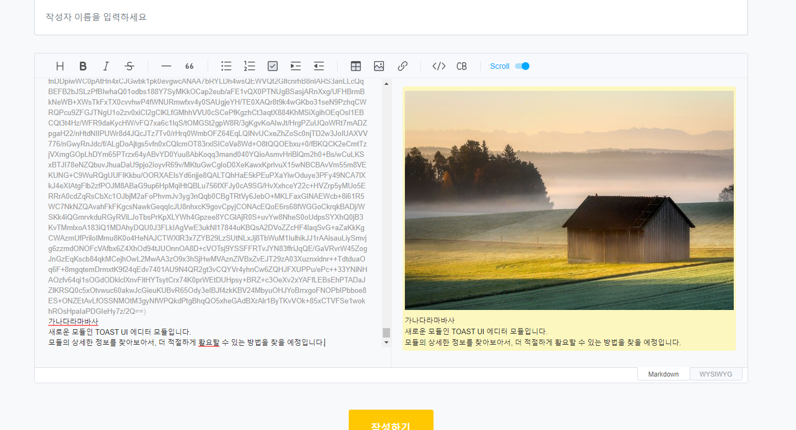

2021년 11월 3일자 프로젝트 진행
===================
## 1. .TOAST UI 컴포넌트 적용
````
const Editor = toastui.Editor;
const editor = new Editor({
    el: document.querySelector('#write-contents'),
    height: '600px',
    viewer: true,
    initialEditType: 'markdown',
    previewStyle: 'vertical'
});
````
기존의 네이버 스마트 에디터를 적용하려던 계획에서, 여러가지 한계점으로 인해, 모듈을 변경하기로 결정함.      
TOAST UI를 선택하였습니다.     

      
모듈을 적용한 화면은 위와 같습니다. 실제 컨트롤러와의 데이터 연동은 적용되지 않은 상태입니다.    

## 다음의 목표
* 모듈의 추가기능이나 어떻게 사용할지에 대한 방향을 정함
* 모듈과 컨트롤러 데이터 연동
* 모듈을 전체 글쓰기 폼 페이지에 적용